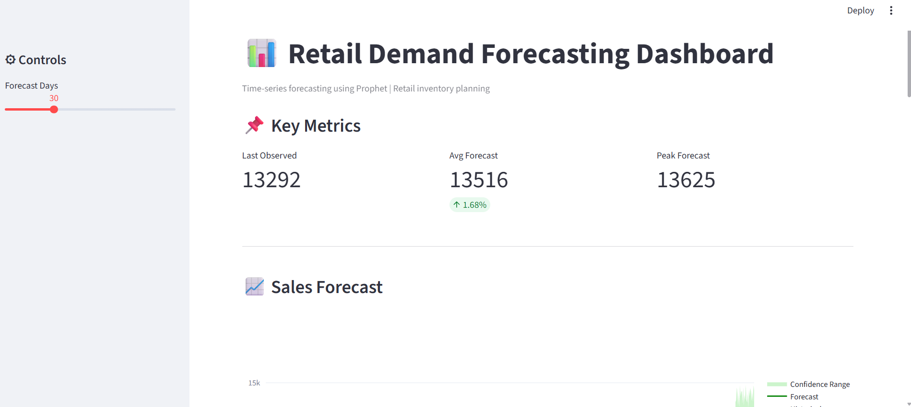
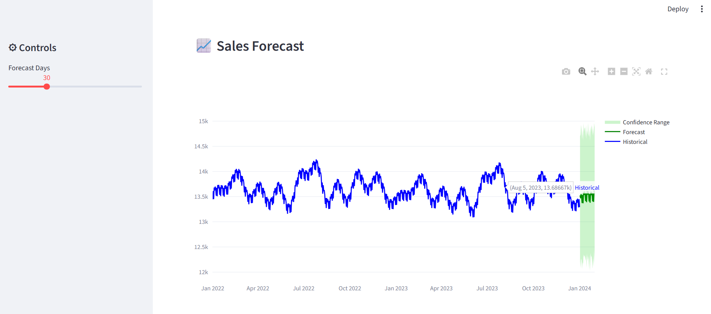
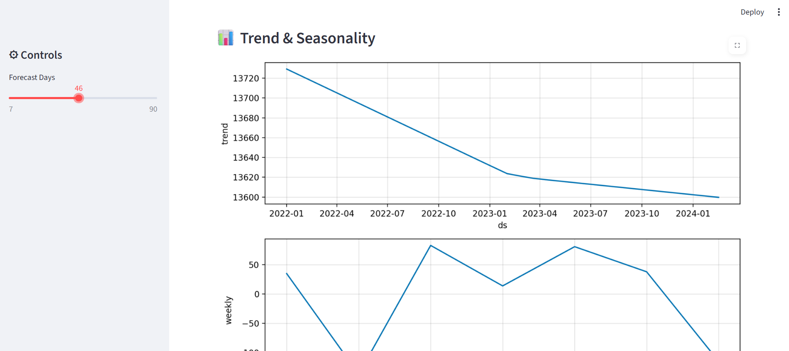
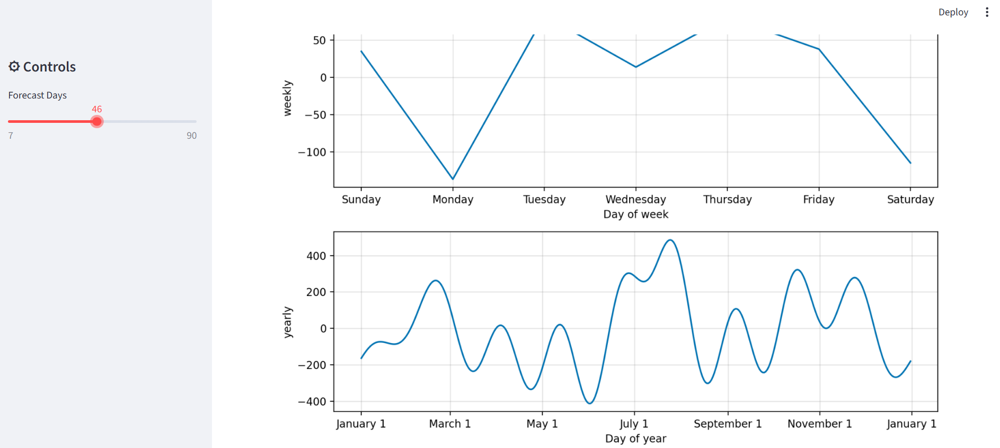
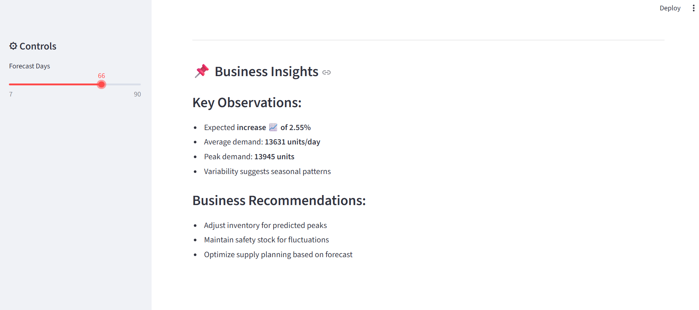

# Retail Demand Forecasting Dashboard

This project predicts future retail demand using time-series forecasting and provides an interactive dashboard.
---

## 🚀 Dashboard Preview

### Main Dashboard

### Forecast Chart

### Key Metrics

### Trend & Seasonality

### Controls Panel
 

---

## Features
- Forecast future sales using Prophet
- Interactive Streamlit dashboard
- Visualize trends, seasonality, and confidence intervals
- Business insights for inventory planning

## Tech Stack
- Python
- Pandas
- Prophet
- Streamlit
- Plotly

## How to Run
1. Install dependencies:
   pip install -r requirements.txt

2. Run the app:
   python -m streamlit run app.py

 ## 🔄 Retraining the Model

python train_model.py

## Output
- Sales forecast graph
- Key metrics
- Business insights
